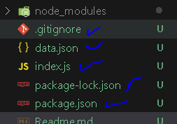
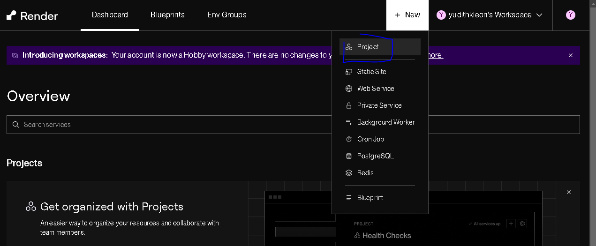
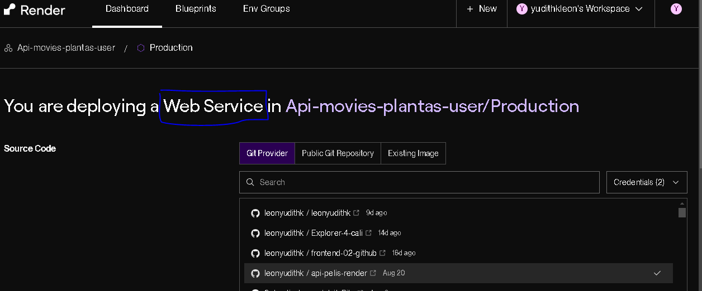

# 1er paso: 
 npm init -y

# 2do paso:
 npm install json-server

# 3er paso: 
crear el index.js con la configuración para render

        const jsonServer = require("json-server");
        const server = jsonServer.create()
        const router = jsonServer.router("data.json")
        const middlewares = jsonServer.defaults()
        const port = process.env.PORT || 3025

        server.use(middlewares)
        server.use(router)
        server.listen(port)

# 4to Paso:
Crear el archivo json

# 5to paso:
Crear el .gitignore

# 6to  paso:
Subir al repositorio personal 
   
   

# 7mo paso:
Abrir https://render.com/  deben autenticarse, iniciar sesión (google | Github)

